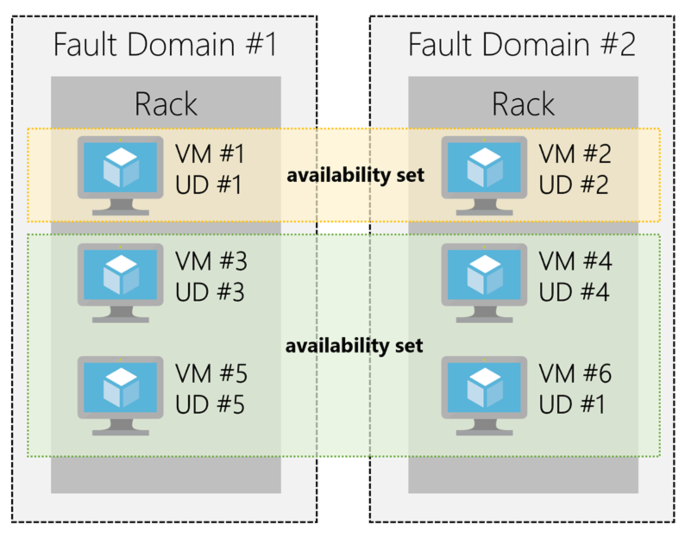

Virtual Machines

#### Virtual Machines
 Just like a physical computer, you can customize all of the software running on the VM. VMs are an ideal choice when you need:
- Total control over the operating system (OS)
- The ability to run custom software, or
- To use custom hosting configurations

Selecting an image is one of the most important decisions you'll make when creating a VM. An image is a template used to create a VM. These templates already include an OS and often other software, like development tools or web hosting environments.

##### Scaling #####
You can run single VMs for testing, development, or minor tasks, or group VMs together to provide high availability, scalability, and redundancy.  Azure has several features so that no matter what your uptime requirements:
- Availability sets
- Scale sets
- Azure Batch

An **availability set** is a logical grouping of two or more VMs that help keep your application available during *planned* or *unplanned* maintenance. VM's in an availability set automaticlly switch to a working VM or sequence maintenance to maximise availability.

**Scale Sets** let you create and manage a group of identical, load balanced VMs. Imagine you're running a website that enables scientists to upload astronomy images that need to be processed. If you duplicated the VM, you'd normally need to configure an additional service to route requests between multiple instances of the website. VM Scale Sets could do that work for you.

**Azure Batch** enables large-scale job scheduling and compute management with the ability to scale to tens, hundreds, or thousands of VMs.

***