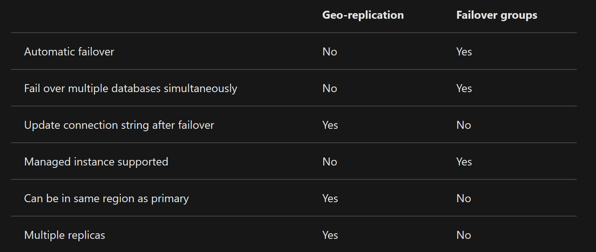

GeoReplication & Failover Groups

By default, the cluster of nodes for the premium availability model is created in the same datacenter. With the introduction of Azure Availability Zones, SQL Database can place different replicas of the Business Critical database to different availability zones in the same region. To eliminate a single point of failure, the control ring is also duplicated across multiple zones as three gateway rings (GW). The routing to a specific gateway ring is controlled by Azure Traffic Manager (ATM). 

***
### GeoReplication
Active geo-replication is designed as a business continuity solution that allows the application to perform **quick disaster** recovery of individual databases in case of a **regional disaster or large scale outage**. If geo-replication is enabled, the application can initiate failover to a secondary database in a different Azure region. Up to four secondaries are supported in the same or different regions, and the secondaries can also be used for read-only access queries. The failover must be initiated manually by the application or the user. After failover, the new primary has a different connection end point. *Traffic to different end-points is managed by the Azure Traffic Manager. **It is not supported for SQL managed instance.**

- Active GeoReplication can only be done single databases (no group/ server level functionality).
- Use database level firewall rules so that these are copied to the secondary database
- Use either database scoped users or AAD to manage authentication to the secondary database
- Ensure that backup retention of the secondary database matches the primary database

https://docs.microsoft.com/nl-nl/azure/sql-database/sql-database-active-geo-replication
***
### Failover Groups
Auto-failover groups is a SQL Database feature that allows you to manage replication and failover of a group of databases on *a SQL Database server or all databases in a managed instance* to another region. **It is a declarative abstraction on top of the existing active geo-replication feature, designed to simplify deployment and management of geo-replicated databases at scale.** You can initiate failover manually or you can delegate it to the SQL Database service based on a user-defined policy. The latter option allows you to automatically recover multiple related databases in a secondary region after a catastrophic failure or other unplanned event that results in full or partial loss of the SQL Database service’s availability in the primary region. A failover group can include one or multiple databases, typically used by the same application.

Additionally, you can use the readable secondary databases to offload read-only query workloads. Because auto-failover groups involve multiple databases, these databases must be configured on the primary server.

https://docs.microsoft.com/nl-nl/azure/sql-database/sql-database-auto-failover-group?tabs=azure-powershell

***
### What to use when?

